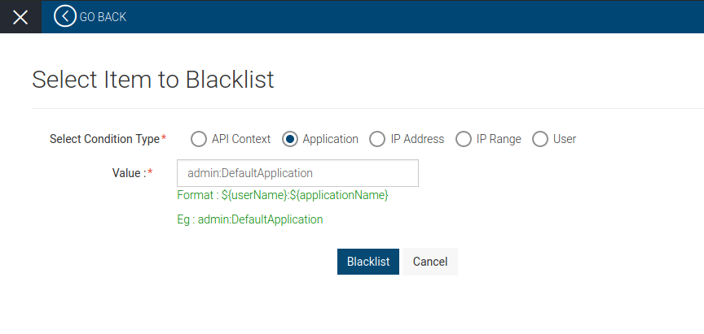
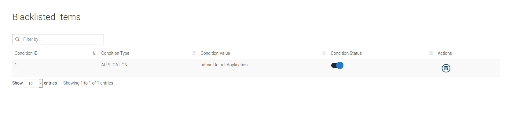
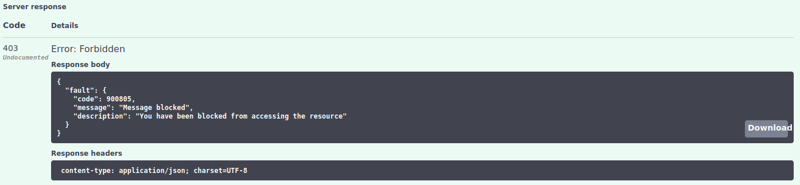
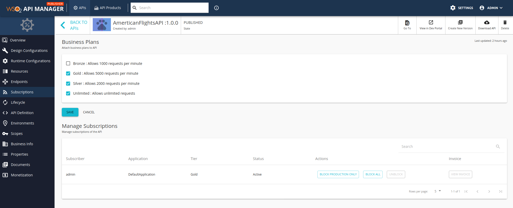
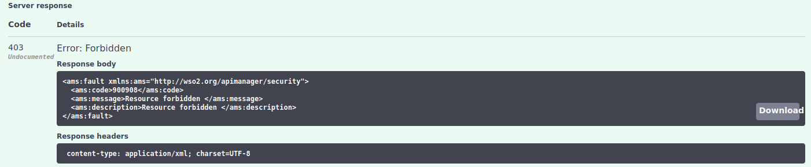

# Blacklisting a user/application

_The airport platform analysts identify that a user is misbehaving with a user account with a created application. Therefore, they are required to blacklist the application user temporarily._

  

#### 1. Add a Blacklist Policy from Admin Portal

API Manager provides the ability to blacklist an API context, an application, an IP address, an IP range or a user. In this tutorial we will temporarily blacklist admin for the DefaultApplication.

1.1 Navigate to the Admin Portal https://localhost:9443/admin and sign in with admin/admin credentials.

1.2. Click on the **THROTTLING POLICIES** to expand it and click on **BLACK LIST POLICIES**. 

  

1.3. Click **ADD BLACKLIST POLICY** and select **Application** from **Select Condition Type**.

1.4. Enter **admin:DefaultApplication** as the Value.

  

1.5. Click **Blacklist**.

1.6. Then, **Blacklisted Items** will be listed out under **BLACKLIST POLICIES**. You can temporarily on/off the blacklisting condition by enabling/disabling the **Condition status** that is auto enabled when a blacklisting condition is created.

  

#### 2. Test the applied Blacklist Policy

2.1. Navigate to Dev Portal https://localhost:9443/devportal and select the AmericanFlightsAPI from the APIs.

2.2. Click **Try Out** to navigate to the API Console.

2.3. Try to execute a method resource.

2.4. You can observe the following response.

  

> **Note**: Subscription blocking
>  
>  Apart from the blacklisting process the capability of blocking subscriptions is provided  from the Publisher where we can restrict the access for the corresponding API for the particular subscription.

    

> After blocking the subscription, the users of that subscription will be given 403 Forbidden responses.

    

This tutorial is part of a tutorial series on API advanced features.

The previous tutorial is on [Adding Role-based Access Control for the APIs](1-role-based-auth.md).

The next tutorial is on [Adding a User Sign Up Workflow](3-sign-up-workflow.md).
