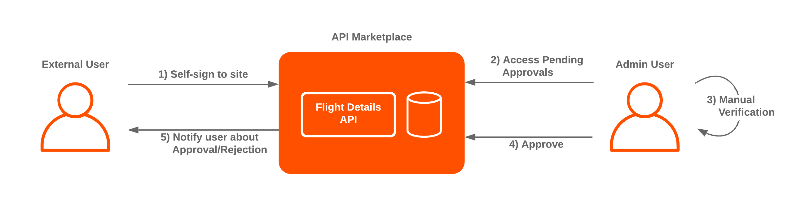
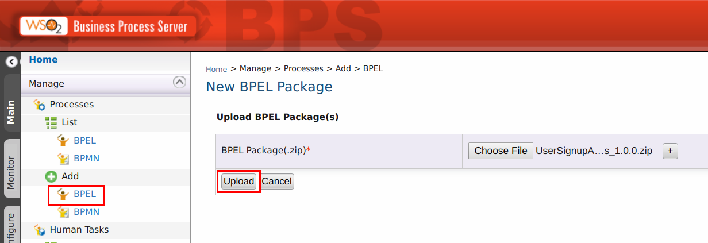
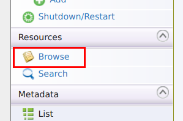
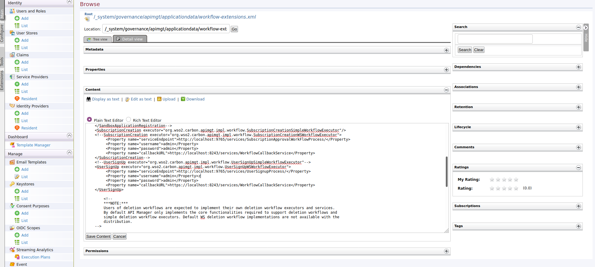
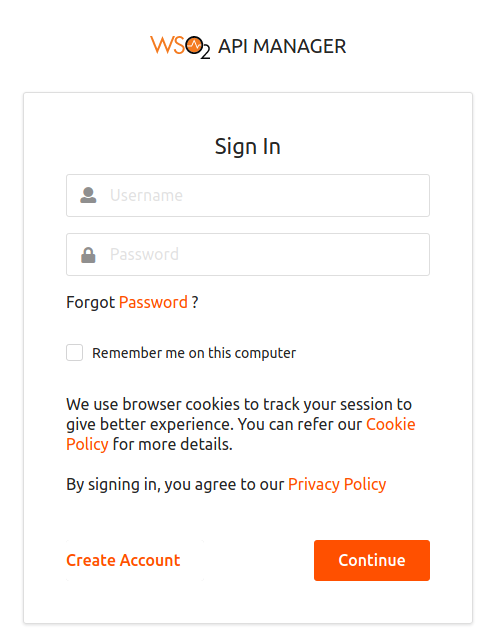
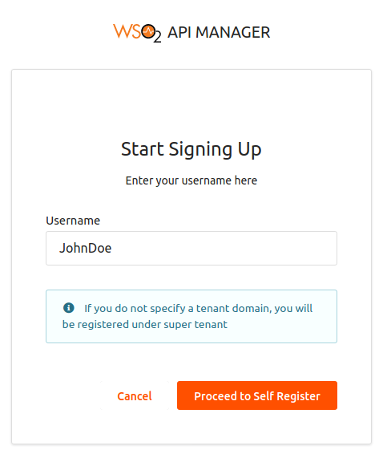

# Add a User Sign up workflow

_Qantas Airlines has decided to open the registration to outside users since it can be a burden to enter all the details for every single user/consumer. Therefore, they request an approval workflow for user registration in such a way that the users will be registered to the system when a user with administrative privileges approves their registration after a manual validation of the user. (A manual validation can consist of a simple process such as checking validity of the email address to a complicated process such as waiting for a registration payment, a background check contacting the user by the provided telephone number or validating the address of the user similar to banks)_

  

#### 1. Configuring WSO2 Enterprise Integrator

WSO2 API Manager provides the capability of adding workflows for tasks such as User registration, Application creation, API subscription etc. In this tutorial you will be creating a sign up workflow using WSO2 Enterprise Integration for the configuration process.

1.1. Download [WSO2 Enterprise Integrator](https://wso2.com/enterprise-integrator/6.6.0).

1.2. Make sure that an offset of 2 is added to the default EI port in the <EI_HOME>/wso2/business-process/conf/carbon.xml file. This prevents port conflicts that occur when you start more than one WSO2 product on the same server. For more information, see [Changing the Default Ports with Offset](https://apim.docs.wso2.com/reference/guides/changing-the-default-ports-with-offset).

`
<Offset>2</Offset>
`

1.3. Open the <EI_HOME>/wso2/business-process/conf/humantask.xml file and <EI_HOME>/wso2/business-process/conf/b4p-coordination-config.xml file and set the TaskCoordinationEnabled property to true. For further information on this configuration see [Configuring Human Task Coordination](https://docs.wso2.com/display/BPS360/Configuring+Human+Task+Coordination).

1.4. Copy the following 2 files from the <API-M_HOME>/business-processes/epr folder to the <EI_HOME>/wso2/business-process/repository/conf/epr folder.

* <API-M_HOME>/business-processes/epr/UserSignupProcess.epr
* <API-M_HOME>/business-processes/epr/UserSignupService.epr

> **Note:** Create the directory <EI_HOME>/wso2/business-process/repository/conf/epr in case it is not available.

1.5. Update the <API-M_HOME>/business-processes/epr/UserSignupProcess.epr file according to the port offset configured in API Manager. (Default port 8243).

`<wsa:Address>https://localhost:8243/services/WorkflowCallbackService</wsa:Address>
`

1.6. Update the <API-M_HOME>/business-processes/epr/UserSignupService.epr file according to the port offset of EI. (Default port 9763 + 2).

`<wsa:Address>http://localhost:9765/services/UserApprovalService</wsa:Address>
`

1.7. [Start the EI server](https://docs.wso2.com/display/EI650/Running+the+Product#RunningtheProduct-Startingtheserver) (business-process) and log in to its management console. (https://<Server-Host>:9443+<port-offset>/carbon)

1.8. Select **BPEL** under the **Processes** > **Add** menu and upload the <API-M_HOME>/business-processes/user-signup/BPEL/UserSignupApprovalProcess_1.0.0.zip file to EI. This is the business process archive file.

1.9. Select **BPEL** under the **Processes** > **Add** menu and upload the <API-M_HOME>/business-processes/user-signup/BPEL/UserSignupApprovalProcess_1.0.0.zip file to EI. This is the business process archive file.

  

1.10. Click **Upload** after adding the file.

1.11. Select **Add** under the **Human Tasks** menu and upload the <API-M_HOME>/business-processes/user-signup/HumanTask/UserApprovalTask-1.0.0.zip file to EI. This is the human task archived file.

  

1.12. Click **Upload** after adding the file.

1.13. If you refresh the browser, the uploaded files can be observed under **Processes** > **List** > **BPEL** and **Human Tasks** > **List**.

Alternatively you can use [WSO2 Business Process Server](http://wso2.com/products/business-process-server/) instead of Enterprise Integrator. If you want to learn about configuring BPS, click [here](https://apim.docs.wso2.com/en/latest/develop/customizations/adding-a-user-signup-workflow/#configuring-the-business-process-server). 

#### 2. Configuring WSO2 API Manager

2.1. Open the <API-M_HOME>/repository/deployment/server/jaggeryapps/admin/site/conf/site.json file and configure **workFlowServerURL** under **workflows** to point to the EI/BPS server (e.g. "workFlowServerURL": "https://localhost:9445/services/" )

#### 3. Engaging the WS Workflow Executor in the API Manager

3.1. Log in to API-M management console ( https://<Server-Host>:9443/carbon ) and select **Browse** under **Resources**.

  

3.2. Copy **/_system/governance/apimgt/applicationdata/workflow-extensions.xml** and paste it into the **Location** field and click **Go**.

3.3. Click **Edit as text** and in the configuration navigate to the UserSignUp workflow config.

3.4. Disable UserSignUpSimpleWorkflowExecutor and enable UserSignUpWSWorkflowExecutor. Moreover, specify the service endpoint where the workflow engine is hosted and the credentials required to access the said service via basic authentication (i.e., username/password based authentication).

  

  

3.5. Click **Save Content** to update the configuration.

#### 4. Test the User Sign up Workflow

4.1. Navigate to the Dev Portal https://localhost:9443/devportal and logout if you are already logged in.

4.2. Click **Sign-in** and click **Create Account**.

  

4.3. Enter a valid available username and click **Proceed to Self Register**.

* Username → JohnDoe

  

4.4. Enter the details and press **Register**.

* First Name  → John
* Last Name   → Doe
* Password    → password
* Email       → email@abc.com

  

4.5. The account will be registered to the system.

4.6. Try to login with the credentials of the newly created account.

4.7. You will be prompted with a dialog box with Forbidden message.

  

4.8. Navigate to the API Manager Admin Portal https://localhost:9443/admin and login to the portal using admin/admin credentials.

4.9. Navigate to **Tasks** > **User Creation** and in the Approval Tasks section the approval task of the newly created user will be displayed.

  

4.10. Click **Start** in the task.

4.11. You will be able to select whether to approve or reject the user sign up request. Select **Approve** and Click **Complete**.

4.12. Navigate back to the **Sign In** page of Dev Portal and sign in using the credentials of the newly created user account. You will be able to sign in to the account and navigate to the devportal homepage and subscribe to the APIs from the tenant.

The addition of workflows provides control over the processes while providing the users capability to carry out their work. 

This tutorial is part of a tutorial series on API advanced features.

The previous tutorial is on [Blacklisting a User/Application](2-blacklisting.md).

The next tutorial is on [Managing Multiple Tenants using API Manager](4-manage-tenants.md).
