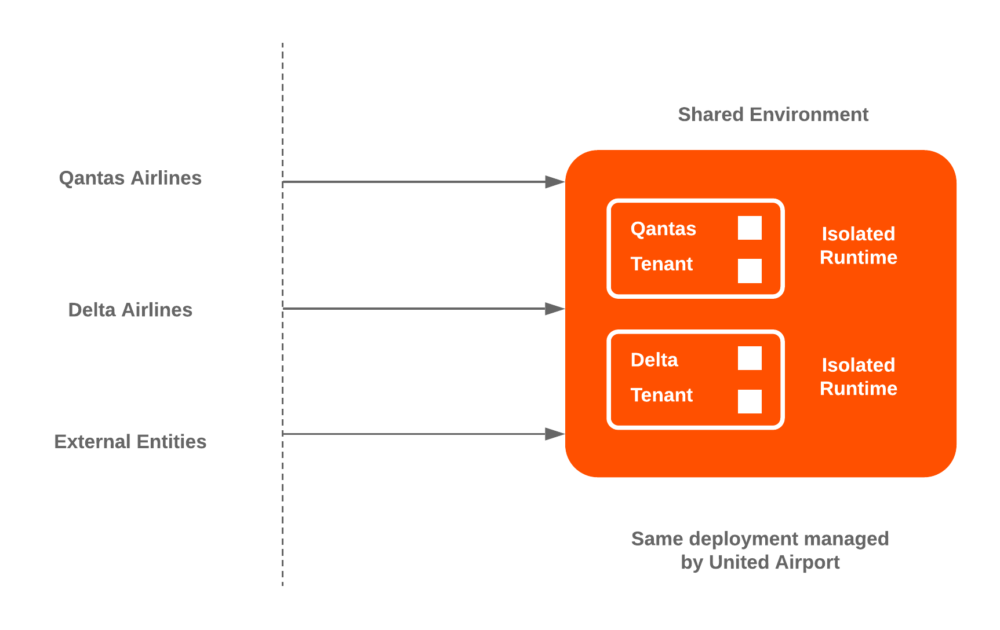
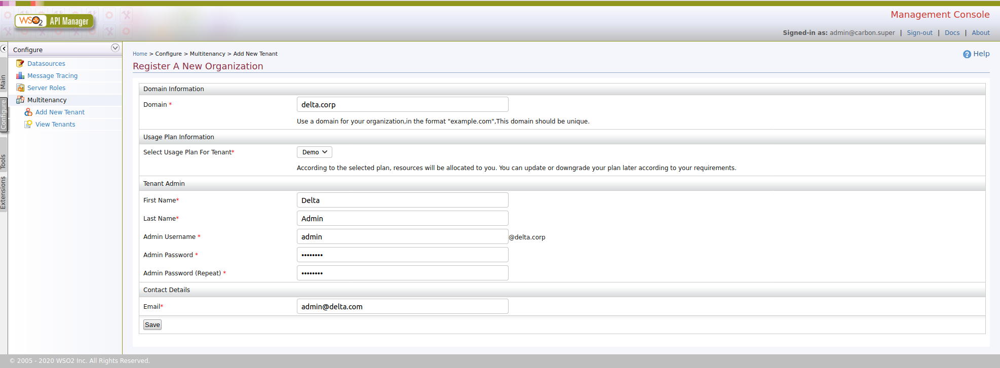
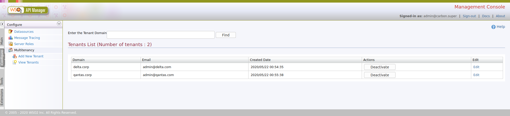
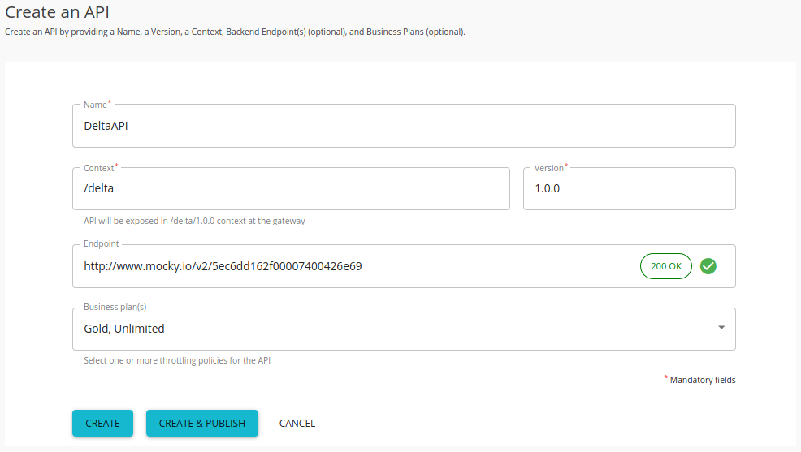
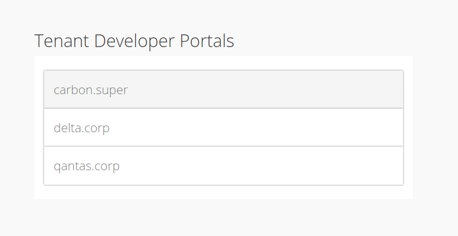
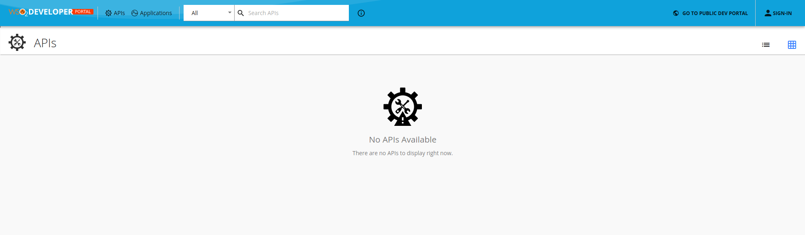
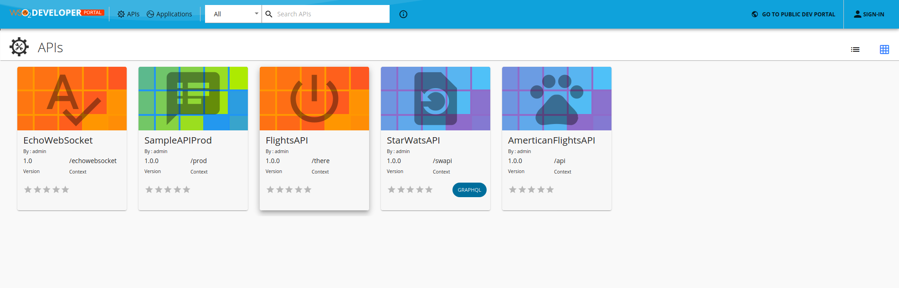

# Managing Multiple Tenants using API Manager

_Since Delta Airlines and Qantas Airlines are competitors, they request dedicated separate environments for their APIs. Therefore, WSO2 United Airport is required to provide two isolated environments for the airlines companies with uncoupled user management, data management, request throttling and security policies._

The goal of multi-tenancy is to maximize resource sharing by allowing multiple users (tenants) to log in and use a single server/cluster at the same time, in a tenant-isolated manner. That is, each user is given the experience of using his/her own server, rather than a shared environment. Multitenancy ensures optimal performance of the system's resources such as memory and hardware and also secures each tenant's personal data.

  

#### 1. Create a new Tenant

1.1. Log in to the API-M management console (https://localhost:9443/carbon) and Click **Add New Tenant** in the **Configure** tab.

  

1.2. Create Tenant domains delta.corp for Delta Airlines and qantas.corp for Qantas Airlines. (The following details were used for delta.corp domain)

* Domain                          → delta.corp
* Select Usage Plane for Tenant   → Demo
* First Name                      → Delta
* Last Name                       → Admin
* Admin Username                  → admin
* Admin Password                  → password
* Email                           → admin@delta.com

  

1.3. After saving, the newly added tenant appears in the **Tenants List** page as shown below. Click **View Tenants** in the **Configure** tab of the management console to see information of all the tenants that currently exist in the system.  Enter the domain name in the **Enter the Tenant Domain** parameter and click **Find** to find the newly added tenant in the list.

  

1.4. You have the ability to **Deactivate** and **Activate** the created Tenants when required from the API-M Management Console.

#### 2. Publisher Tenants

2.1. Navigate to the Dev Portal https://localhost:9443/devportal and logout if you are already logged in.

2.2. You can login to the Publisher using the username **admin@delta.corp** and the password used when creating the tenant. This will direct you to the delta.corp Publisher which currently does not consist of any APIs. (You can see that the previously created APIs are not accessible as they are in the super tenant)

  

2.3. Let’s create a sample API with a mock backend and publish it. First, click **CREATE NEW API** > **Design a New REST API** and provide the following details. (We have used an endpoint created using http://www.mocky.io for the backend which gives the response {"data":"Delta API response"})

* Name              → DeltaAPI
* Context           → delta
* Version           → 1.0.0
* Endpoint          → http://www.mocky.io/v2/5ec6dd162f00007400426e69
* Business Plan(s)  → Gold, Unlimited

  

2.4. Click **CREATE & PUBLISH**.

#### 3. Tenant Developer Portals

3.1. Navigate to API Dev Portal https://localhost:9443/devportal. The Developer Portal fronts of all the registered tenant domains are listed on the landing page.

  

This is referred to as the public developer portal. Each icon here is linked to the API developer portal of a registered tenant, including the super tenant, which is carbon.super.

3.2. Click on delta.corp to enter the Delta Airlines tenant dev portal, which consists of the newly published **DeltaAPI**.

  

3.3. If you go back to Public Portal and visit qantas.corp tenant you will see that it does not have any published APIs.

  

3.4. The carbon.super tenant dev portal consists of all the previously published APIs.

  

Anonymous users can browse all developer portals and all public APIs that are published to them. However, in order to subscribe to an API, the user must log in.

You can also browse the other tenant developer portals listed in the public developer portal. But, within other tenant developer portals, you can only subscribe to the APIs to which your tenant domain is permitted to subscribe to. At the time an API is created, the API creator can specify which tenants are allowed to subscribe to the API.

3.5. Login to API-M Publisher delta.corp tenant using **admin@delta.corp** username and password.

3.6. Navigate to the created **DeltaAPI** > **Subscriptions** section.

3.7. Under Subscription Availability, you can specify whether the API is available for all the tenants, this tenant only or for specify tenants.

  

3.8. After doing the required changes you can navigate to **Lifecycle** > **Redeploy**.

Thereafter, users from the specified tenants permitted by the publisher can subscribe to the corresponding API with their user accounts.

This tutorial is part of a tutorial series on API advanced features.

The previous tutorial is on [Adding a User Sign Up Workflow](3-sign-up-workflow.md).

The next tutorial is on [Different API Protocol Support](5-supported-protocols.md).
