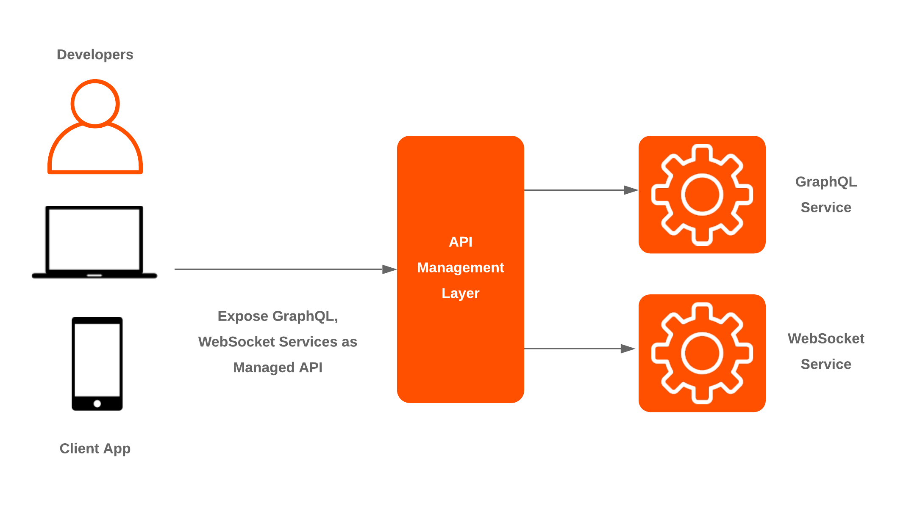
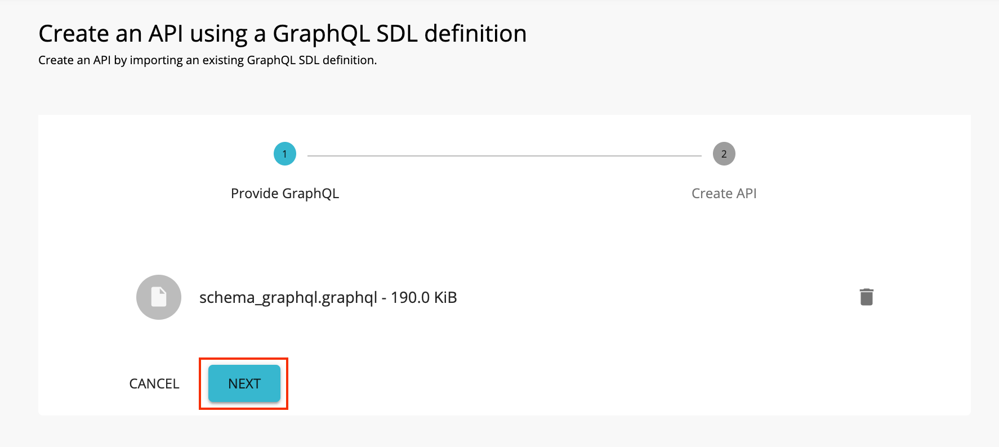
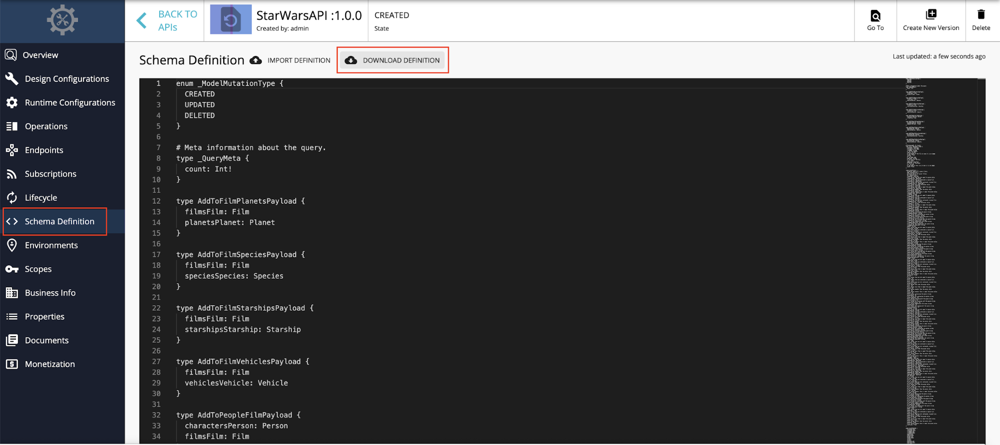
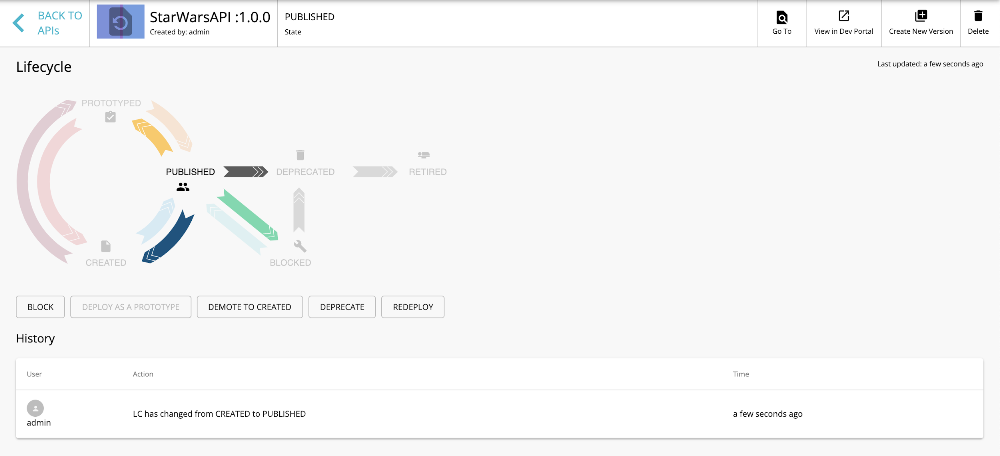
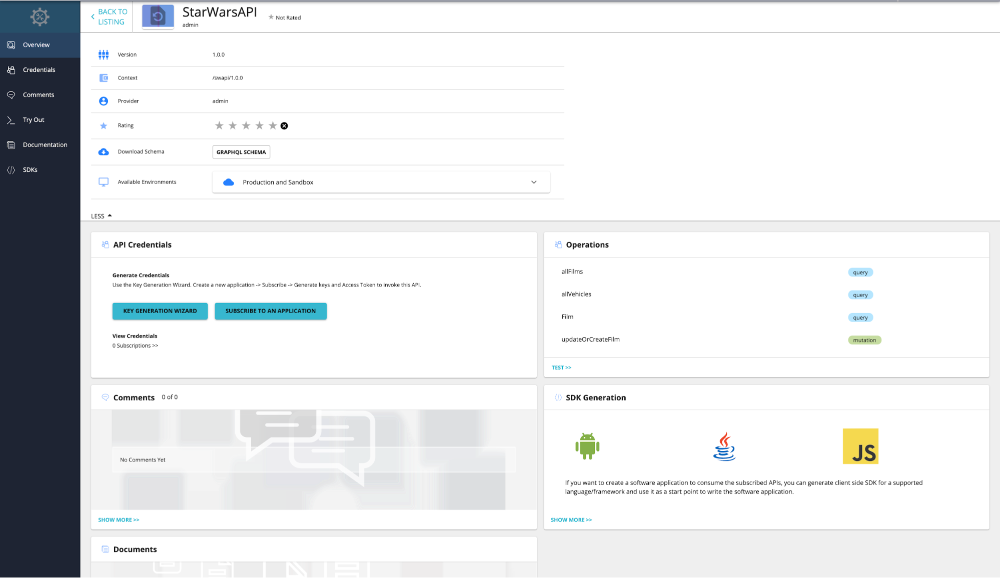
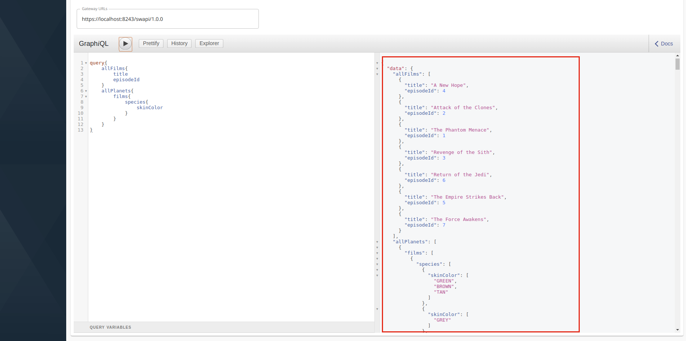
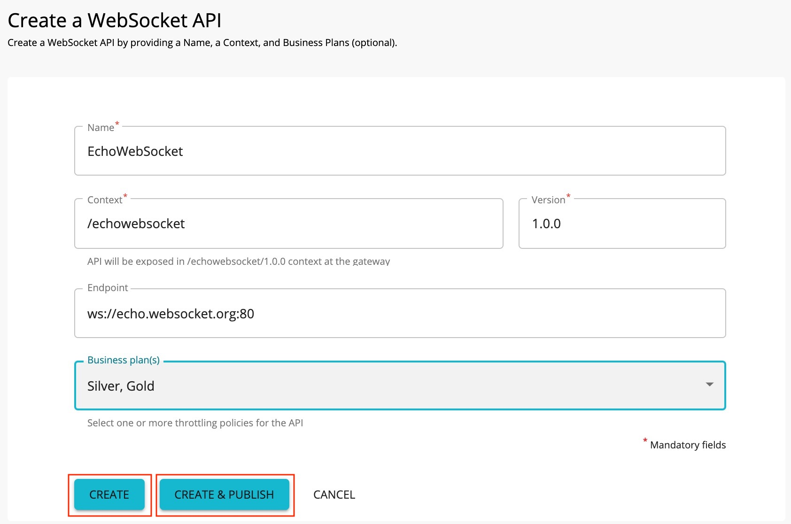
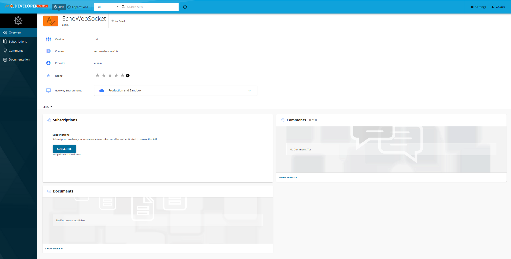

# Different API Protocol Support

_The new partners of WSO2 United Airport, Delta Airlines and Qantas Airlines both do not use REST/SOAP as their APIs. Delta Airlines are developing a new mobile application for booking flights and they are planning to use GraphQL for the APIs as it provides developers more freedom to request for specific data they require. On the other hand, Qantas Airlines is implementing a chat application for communication between flights and ground staff using WebSocket APIs. Therefore, the airport is required to provide the facilities to accommodate the publishing and managing of the required API protocol types._

  

## Create a GraphQL API using Publisher

GraphQL is a data query language developed internally by Facebook which provides developers the ability to explicitly specify the data they require from frontend. Hence, GraphQL APIs can be considered as a mandatory requirement for a modern API Management platform. A Schema Definition Language (SDL) schema can be used to design an API from API-M Publisher similar to using an OpenAPI Specification (Swagger file) when designing a REST API.

#### 1. Design a GraphQL API

1.1. Navigate to the API Publisher Portal https://localhost:9443/publisher and sign in with **admin/admin** as the credentials.

1.2. Click **CREATE API** and then click **I Have a GraphQL SDL schema**.

  

1.3. Import the schema and click **Next**. (You can download the StarWarsAPI schema definition for this tutorial)

  

> **Note:** You need to define the SDL Schema based on the GraphQL schema design best practices. The file extension can be either .graphql, .txt, or .json.

  

1.4. Enter the GraphQL API related details as follows and click **Create**.

* Name              → StarWarsAPI
* Context           → /swapi
* Version           → 1.0.0
* Endpoint          → https://api.graph.cool/simple/v1/swapi
* Business Plan(s)  → Unlimited

  

1.5. You can modify the existing GraphQL schema definition.

1.5.1. Click **Schema Definition**.

1.5.2. Click **DOWNLOAD DEFINITION**. The existing GraphQL API schema gets downloaded.

  

1.5.3. Update the schema definition as required.

1.5.4. Click **IMPORT DEFINITION** to import the updated schema definition.

1.6. Instead of **Resources** which are populated for REST APIs, **Operations** are populated for GraphQL APIs. You can update the operations as required by navigating to the **Operations** section.

You will be provided with the capability to add RateLimiting, to create and add scopes and enable/disable security for individual operations. In this tutorial we will not be going through those features; you can follow [Create and Publish a GraphQL API](https://apim.docs.wso2.com/en/latest/learn/tutorials/create-and-publish-a-graphql-api/) to test scopes and other features provided.

#### 2. Publish the GraphQL API

2.1. Click **LIFECYCLE** to navigate to the API lifecycle and click **PUBLISH** to publish the API to the Dev Portal.

  

#### 3. Invoke the GraphQL API

3.1. Click **View in Dev Portal** to navigate to the published StarWarsAPI.

3.2. Login to the Dev Portal using **admin/admin** credentials.

3.3. In the **Overview**, Click **SUBSCRIBE** in the Subscriptions section.

  

3.4. Click **SUBSCRIBE** in the Subscribe form with DefaultApplication as the Application.

3.5. Click **PROD KEYS** from the available Subscriptions.

3.6. Click **GENERATE KEYS** from the expanded panel.

  

3.7. Click **GENERATE ACCESS TOKEN** and click **GENERATE**. (You can add the required scopes if you have created and added to the operations)

3.8. Copy the Access Token.

  

3.9. Copy the Access Token.

3.10. Click **Try Out** to navigate to the API Console.

3.11. Paste the access token that you previously copied into the **Access Token** field.

3.12. You are provided with a GraphQL API console in this section where you can try out any query or mutation you want to test.

3.13. Enter the following sample payload as the StarWarsAPI request.

    query{  
       allFilms{  
          title  
          episodeId  
       }  
       allPlanets{  
          films{  
             species{  
                skinColor  
             }  
          }  
       }  
    }  

3.14. Click **Execute**.

  

3.15. You can observe the response as follows.

  

## Create a WebSocket API using Publisher

WebSocket is a protocol similar to HTTP that is part of the HTML5 specification. It enables simultaneous two-way communication (full-duplex communication) between the client and the server over a single connection.

#### 1. Design and Publish a WebSocket API

1.1. Navigate to the API Publisher Portal https://localhost:9443/publisher and sign in with **admin/admin** as the credentials.

1.2. Click **CREATE API** and then click **Design a New WebSocket API**.

  

1.3. Enter the following details in **Create a WebSocket API** form and click **CREATE & PUBLISH**. (If you want to change endpoint configurations such as [Endpoint Timeouts](https://apim.docs.wso2.com/en/latest/learn/design-api/endpoints/resiliency/endpoint-timeouts/), [Endpoint Suspension](https://apim.docs.wso2.com/en/latest/learn/design-api/endpoints/resiliency/endpoint-suspension) and [Prevent API Suspension](https://apim.docs.wso2.com/en/latest/learn/design-api/endpoints/resiliency/prevent-api-suspension), you can create the API first and after changing the configurations then publish. Since we are keeping the configuration as default we are publishing the API from the creation.)

* Name                → EchoWebSocket
* Context             → /echowebsocketw
* Version             → 1.0.0
* Endpoint            → ws://echo.websocket.org:80
* Business Plan(s)    → Silver, Gold

  

#### 2. Invoke a WebSocket API

2.1. Click **View in Dev Portal** to navigate to the published EchoWebSocketAPI.

2.2. Login to the Dev Portal using **admin/admin** credentials.

2.3. In the **Overview**, Click **SUBSCRIBE** in the Subscriptions section.

  

2.4. Click **SUBSCRIBE** in the Subscribe form with DefaultApplication as the Application.

2.5. Click **PROD KEYS** from the available Subscriptions.

2.6. Click **GENERATE KEYS** from the expanded panel.

  

2.7. Click **GENERATE ACCESS TOKEN** and click **GENERATE**.

2.8. Copy the Access Token.

2.9. Install wscat client.

`
npm install -g wscat
`

2.10. Invoke the API by using an authorization header by executing the following command.

`
wscat -c ws://localhost:9099/echowebsocket/1.0.0 -H "Authorization: Bearer [accesstoken]"
`

> **Note**: There are clients (specially browsers) that do not allow to add headers to the Websocket handshake. In such cases, you can send the access token for the Websocket API invocation as a query parameter named access_token by using the command below:
>
>`
wscat -c ws://localhost:9099/echowebsocket/1.0.0?access_token=[accesstoken]
`

This tutorial is part of a tutorial series on API advanced features.

The previous tutorial is on [Managing Multiple Tenants](4-manage-tenants.md).

Next tutorial is on [API Monetization](6-api-monetization.md).
