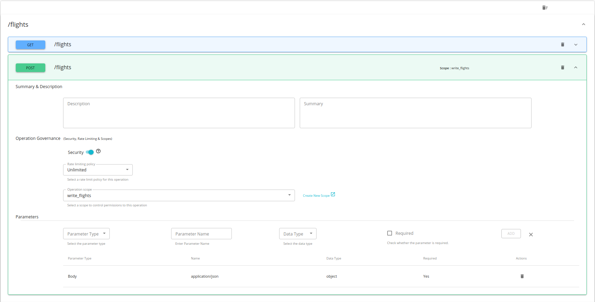

# Add Role-based Access Control for the APIs

_All the employees in the airline company have access to the end-user application where they can view the flight details.  All the staff in the airlines should be able to check the available flights whereas only the staff with admin privileges can add, edit or remove existing flights._ 

  

#### 1. Create a new scope

The scopes can be created and applied to an API resource at create time. You can learn more about the scopes from [here](https://apim.docs.wso2.com/en/latest/learn/api-security/oauth2/oauth2-scopes/fine-grained-access-control-with-oauth-scopes/).

1.1. Navigate to the API Publisher Portal https://localhost:9443/publisher and sign in with **admin/admin** as the credentials.

1.2. Open the created AmericanFlightsAPI API from the list.

1.3. Navigate to the **Scopes** section and click on the **CREATE SCOPES** button.

  

1.4. Fill out the **Create New Scope** form as follows.

* Name         → write_flights
* Description  → Restricting writing flight functionality to admin users
* Roles        → admin

  

In the Roles section you can specify the user role(s) that are allowed to obtain a token against this scope. E.g: manager, employee.

1.5. Click **SAVE** to save the new scope.

#### 2. Apply the created scope to the API resources

The requirement of the airlines company is to provide the flight creating, updating and deleting features to the users with admin privileges. Therefore, the created scope should be applied to all the resources except GET /flights resource.

2.1. Navigate to the **Resources**, click the /flights POST resource to expand it.

2.2. Select the created write_flights from the **Operation scope** and click **SAVE** to update the API.

  

2.3. Publish the API from **Overview** or **Lifecycle**.

#### 3. Obtain tokens and Invoke the APIs (with and without the created scope)

3.1. Click **View in Dev Portal** to navigate to the published AmericanFlightsAPI.

3.2. Login to the Dev Portal using **admin/admin** credentials.

3.3. In the **Overview**, Click **SUBSCRIBE** in the Subscriptions section.

  

3.4. Click **SUBSCRIBE** in Subscribe form with DefaultApplication as the Application.

  

3.5. Click **PROD KEYS** from the available Subscriptions.

3.6. Click **GENERATE KEYS** from the expanded panel.

  

3.7. Click **GENERATE ACCESS TOKEN** and select the required scopes, in this case write_flights from the drop down menu.

  

3.8. Click **GENERATE** and copy the Access Token.

  

3.9. Click **Try Out** to navigate to the API Console.

  

3.10. Paste the copied access token to the **Access Token** field.

  

3.11. Expand /flights POST method and click **Try it out**.

3.12. Add the following json to the payload and click **EXECUTE**.

    {  
      "code": "GQ574",
      "price": 399,
      "departureDate": "2016/12/20",
      "origin": "ORD",
      "destination": "SFO",
      "emptySeats": 200,
      "plane": {
            "type": "Boeing 747",
            "totalSeats": 400 
      }
    }

3.13. You can observe the response.

  

3.14. Go back to the Subscriptions section, and generate a new access token without any scopes. Copy the generated access token.

  

3.15. Try out the /flights POST method with the use of the copied access token.

3.16. You will see the following response.

  

Using the OAuth scopes, you will be able to limit the access of the API and a particular resource based on the roles.

This tutorial is part of a tutorial series on API advanced features.

You can start from the [tutorial overview](README.md).

The next tutorial is on [Blacklisting a user/application](2-blacklisting.md).
