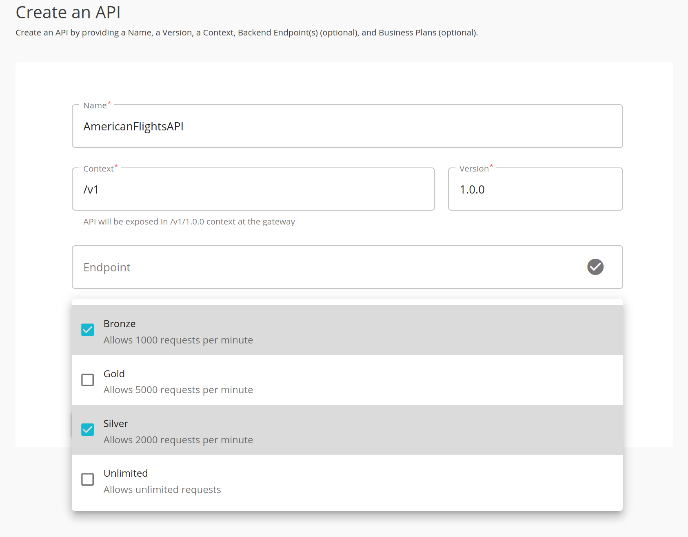
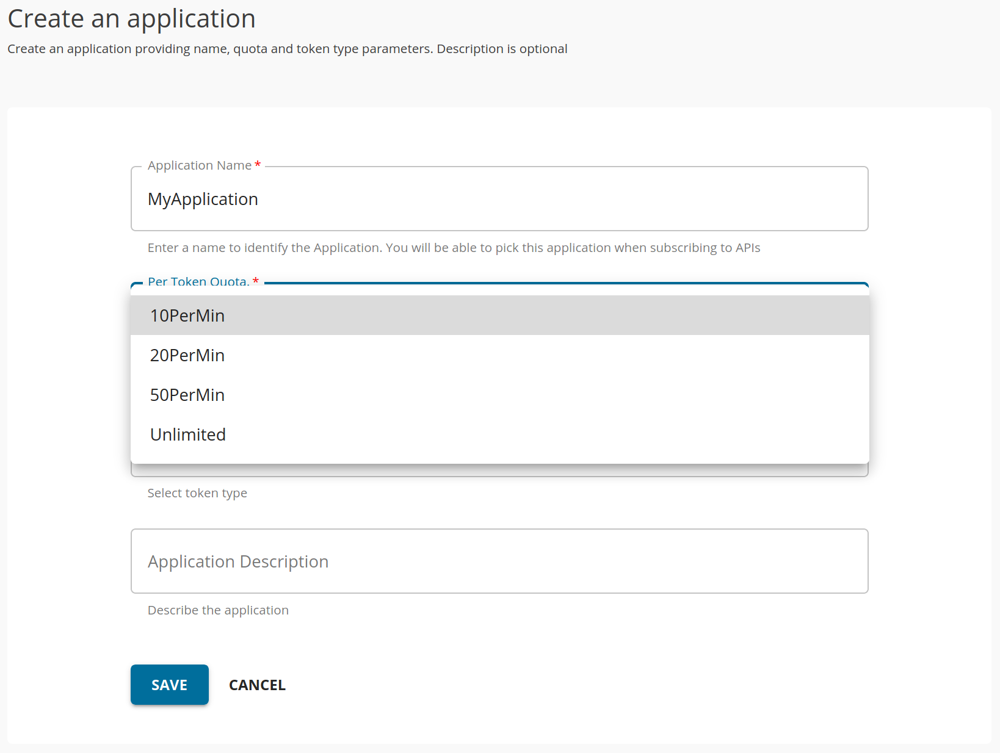

# Throttling and Access Control

Throttling or rate limiting is the process of controlling the number of successful requests/hits to an API in a given period of time. Throttling is typically useful in the following scenarios,

* Protect the API from common types of security attacks such as Denial of Service (DOS).
* To regulate traffic according to infrastructure availability
* To make an API, application, or a resource available to a consumer at different levels of service, usually for monetization purpose

API Manager provides you with the capability to handle throttling in different levels such as subscription level and application whereas the final throttle limit granted to a given user on a given API is ultimately defined by the consolidated output of all throttling tiers together. It is possible to throttle requests for each tier based on the request count per unit time or the amount of data (bandwidth) transferred through the Gateway per unit time. You can configure this via the Admin Portal as explained under [Adding New Throttling Policies](https://apim.docs.wso2.com/en/latest/learn/rate-limiting/adding-new-throttling-policies).

Let's take a look at the different levels of throttling:

#### 1. Subscription-level throttling

Subscription-level throttling tiers can be applied for an API when creating APIs using the API Publisher portal.

  

The default subscription level throttling tiers are as follows:

* **Bronze** : 1000 requests per minute
* **Silver** : 2000 requests per minute
* **Gold** : 5000 requests per minute
* **Unlimited**: Allows unlimited access (you can disable the Unlimited tier by editing the enable_unlimited_tier element under [apim.throttling] in the <API-M_HOME>/repository/conf/deployment.toml file.)

It is also possible to specify a bandwidth per unit time instead of a number of requests. This can be done by an API Manager administrator. For information on editing the values of the existing tiers, defining new tiers, and specifying a bandwidth per unit time, see [Adding a new subscription-level throttling tier](https://apim.docs.wso2.com/en/latest/learn/rate-limiting/adding-new-throttling-policies/#adding-a-new-subscription-level-throttling-tier).

After subscription-level throttling tiers are set and the API is published, at subscription time, the consumers of the API can sign in to the **Developer Portal** and select which tier (out of those enabled for subscribers) they are interested in, as shown below:

  

#### 2. Advanced Throttling

Advanced throttling can be applied when you are publishing an API. It can be divided into two levels based on the applicability. They are API level throttling and Resource level (Operational level) throttling.

_API level throttling_ - API level policies can be applied from the **Resources** section in Publisher under **Operations Configuration** → **Rate limiting level**.

  

_Resource level throttling_ - You can apply throttling policies per resource as well. Similarly, you can set **Operations Level** from **Rate limiting level** and to set the throttling tier from the resource itself.

  

The default advanced throttling tiers are as follows:

* **10KPerMin** : 10,000 requests per minute
* **20KPerMin** : 20,000 requests per minute
* **50KPerMin** : 50,000 requests per minute
* **Unlimited**: Allows unlimited access (you can disable the Unlimited tier by editing the enable_unlimited_tier element under [apim.throttling] in the <API-M_HOME>/repository/conf/deployment.toml file.)

It is also possible to specify a bandwidth per unit time instead of a number of requests. This can be defined via the API Manager Admin Portal. For information on editing the values of the existing tiers, defining new tiers, and specifying a bandwidth per unit time, see [Adding a new advanced throttling policy](https://apim.docs.wso2.com/en/latest/learn/rate-limiting/adding-new-throttling-policies/#adding-a-new-advanced-throttling-policy).

#### 3. Application level throttling

Application-level throttling tiers are defined at the time an application is created in the **Developer Portal** as shown below. The limits are restricted per token for a specific application.

  

An application is a logical collection of one or more APIs and is required to subscribe to an API. Applications allow you to use a single access token to invoke a collection of APIs and to subscribe to one API multiple times with different SLA levels.

The default application level throttling levels are as follows:

* **10PerMin** : 10 requests per minute
* **20PerMin** : 20 requests per minute
* **50PerMin** : 50 requests per minute
* **Unlimited**: Unlimited access. The **Default Application** , which is provided out of the box has the tier set to Unlimited.

It is also possible to specify a bandwidth per unit time instead of a number of requests. This can be done through the Admin Portal of API Manager. For information on editing the values of the existing tiers, defining new tiers and specifying a bandwidth per unit time, see [Adding a new application-level throttling tier](https://apim.docs.wso2.com/en/latest/learn/rate-limiting/adding-new-throttling-policies/#adding-a-new-application-level-throttling-tier).

This tutorial is part of a tutorial series on API advanced features.

The previous tutorial is on [API Monetization](6-api-monetization.md).

If you have not followed the tutorial series, you can start from the [tutorial overview](README.md).