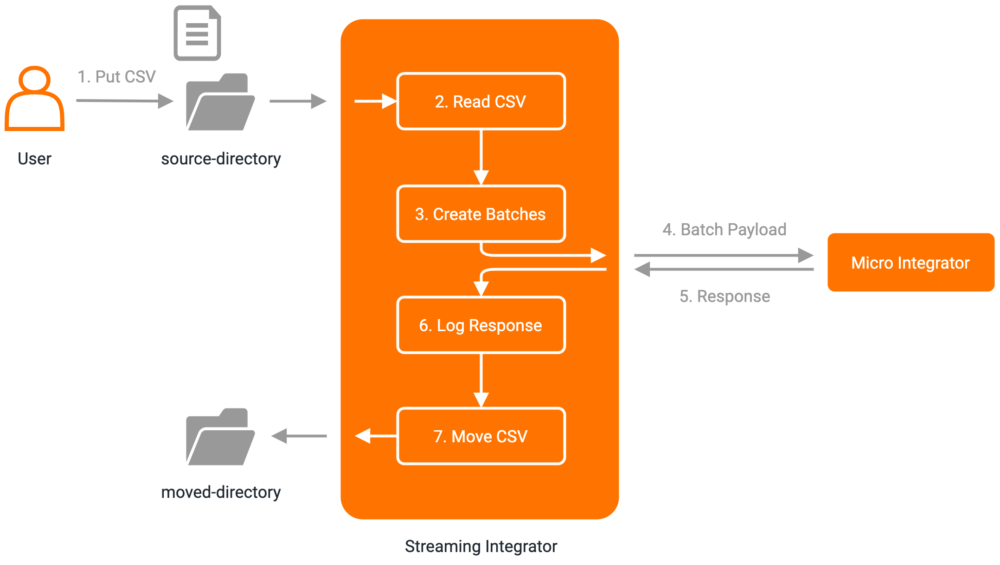

# Send Records from CSV File in Batches to WSO2 MI
This example shows how to use WSO2 Streaming Integrator's directory listening and batching capabilities to read records from CSV files in a directory, accumulate them into batches, and send the batches to WSO2 Micro Integrator.

### Assumptions
This document assumes that you are familiar with WSO2 Streaming Integrator Tooling's interface, and configuring properties of elements from the Design View.

### Example Use Case
This document explains a scenario where customer details containing their salutation, first name, last name and phone are available in a CSV file. These data will be read as batches of 10 records, and sent in bulk to WSO2 Micro Integrator. These batches of data can then be used by WSO2 MI to perform operations such as bulk inserts to Salesforce.



### Set Up and Run the Example

#### Setting up Micro Integrator
1. Copy the `grpcInboundEndpoint.xml` file to `<MI_Home>/repository/deployment/server/synapse-configs/default/inbound-endpoints` directory.
2. Copy the `InSeq.xml` file to `<MI_Home>/repository/deployment/server/synapse-configs/default/sequences`.

#### Configuring the Siddhi App
1. Start WSO2 Streaming Integrator Tooling by going to the `<SI_HOME>/bin` directory, and executing `./tooling.sh` command.
2. Go to _Tools -> Extension Installer_, search for **gRPC**, and install the extension. Please restart WSO2 Streaming Integrator Tooling after installing this extension.
3. Open the provided Siddhi app `CSVToMIInBatches.siddhi`, and save it as `CSVToMIInBatches.siddhi`.
4. Switch to the design view by clicking the **Design View** button.
5. Update the following properties of the **file** source:
    - dir.uri: `file:/path/to/your/source-dir`
    - move.after.process: `file:/path/to/your/moved-dir`
6. Switch back to the code view by clicking the **Code View** button, and save the Siddhi app.

#### Running the Example and Observing the Results
1. Start WSO2 Micro Integrator by going to the `<MI_HOME>/bin` directory, and executing `./micro-integrator.sh` command.
2. Start the Siddhi app. You will see the message `CSVToMIInBatches.siddhi -  Started Successfully!` in your console.
3. Drop the `customers.csv` file to `/path/to/your/source-dir`.
4. The following log will be shown in the MI console for each batch sent, denoting that MI has received the batch:
```
To: , MessageID: urn:uuid:68C49632A2D48ED9AC1591973673039, Direction: request, Envelope: <?xml version='1.0' encoding='utf-8'?><soapenv:Envelope xmlns:soapenv="http://www.w3.org/2003/05/soap-envelope"><soapenv:Body/></soapenv:Envelope>
```
5. You will also see that, response for each batch sent to MI is logged in the SI tooling console, as follows:
```
Response from MI:  : [Event{timestamp=1591973673108, data=[Ms, Patricia, Aakhus, 0712345678], isExpired=false}, Event{timestamp=1591973673108, data=[Mr, Hans, Aanrud, 0712345678], isExpired=false}, Event{timestamp=1591973673108, data=[Mr, David, Aaron, 0712345678], isExpired=false}, Event{timestamp=1591973673108, data=[Ms, Rachel, Aaron, 0712345678], isExpired=false}, Event{timestamp=1591973673108, data=[Ms, Soazig, Aaron, 0712345678], isExpired=false}, Event{timestamp=1591973673108, data=[Mr, Ben, Aaronovitch, 0712345678], isExpired=false}, Event{timestamp=1591973673108, data=[Mr, Alexander, Aaronsohn, 0712345678], isExpired=false}, Event{timestamp=1591973673108, data=[Ms, Hector, Faciolince, 0712345678], isExpired=false}, Event{timestamp=1591973673108, data=[Mr, Christopher, Abani, 0712345678], isExpired=false}, Event{timestamp=1591973673108, data=[Mr, Sait, Abasiyanik, 0712345678], isExpired=false}]
```
6. After being processed, the `customers.csv` file will be moved from `/path/to/your/source-dir` to `/path/to/your/moved-dir`.

### How it Works
The following steps outline how records of a CSV file are batched and sent to WSO2 MI.
1. The file source listens to the source directory for CSV files that have values for columns: salutation, first name, last name and phone.
2. When a CSV file is put to the source directory, it is read line by line, and batches of 10 records are created.
3. A created batch is then sent to WSO2 MI using gRPC transport.
4. WSO2 MI receives the batch and responds back to WSO2 SI.
