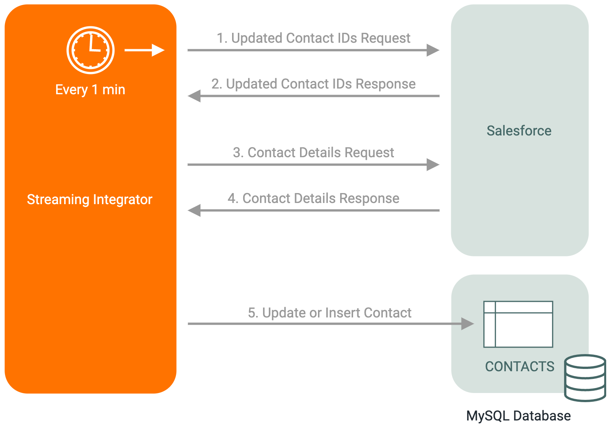

# Mirror Salesforce Contact Updates in MySQL
This example shows how to poll for contact updates in Salesforce from WSO2 Streaming Integrator, and mirror them in a MySQL table.

### Assumptions
This document assumes that you are familiar with the WSO2 Streaming Integrator Tooling interface, and configuring properties of elements from the Design View.

### Example Use Case
This document considers a scenario about a business that maintains a copy of Salesforce contacts in a MySQL table. When a contact is added or updated in Salesforce, the same change is reflected in the MySQL table. This makes sure that contacts are always in sync across Salesforce and the MySQL table.



### Set Up and Run the Example

To follow the steps in this example, you must have MySQL installed.

#### Preparing the MySQL Database
1. Run the provided `data.sql` in your MySQL instance to create the database and the table. This will create a database called `SALESFORCE`, with a table called `CONTACTS`.

#### Configuring the Siddhi App
1. Start WSO2 Streaming Integrator Tooling by going to the `<SI_HOME>/bin` directory, and executing `./tooling.sh` command.
2. Go to _Tools -> Extension Installer_, search for the **RDBMS - MySQL** extension and install it.
3. Restart WSO2 Streaming Integrator Tooling, open the provided Siddhi app: `ReflectSFContactUpdatesInMySQL.siddhi`, and save it as `ReflectSFContactUpdatesInMySQL.siddhi`.
4. Switch to the design view by clicking the **Design View** button.
5. Configure each **http-call** sink to be updated with the following values:
    - publisher.url: `https://<your_salesforce_instance>.salesforce.com/...`.
    - headers: `'Authorization: Bearer <your_access_token>'`
6. Provide values for the following fields of the **CONTACTS** table:
    - jdbc.url: `jdbc:mysql://<MySQL_Host>:3306/etl?useSSL=false`
    - username: `<your_mysql_username>`
    - password: `<your_mysql_password>`
7. Switch back to the code view by clicking the **Code View** button and save the Siddhi app.

#### Running the Example and Observing the Results
1. Verify that there are no existing records in your `CONTACTS` MySQL table, by executing `SELECT * FROM CONTACTS;`.
2. Start the Siddhi app. You will see the message `ReflectSFContactUpdatesInMySQL.siddhi -  Started Successfully!` in your console.
3. Add a contact with the following details in Salesforce.
    - First Name: `John`
    - Last Name: `Doe`
4. Polling will happen at the end of the first minute after starting the Siddhi app, with the following log:
```
Polling for updates, StreamEvent{ timestamp=1591961486072, beforeWindowData=null, onAfterWindowData=null, outputData=[null, null], type=CURRENT, next=null}
```
5. The following log will be shown, denoting that the insertion of Salesforce contact has been detected:
```
No of Updated Events : Event{timestamp=1591961487441, data=[1], isExpired=false}
```
6. Execute `SELECT * FROM CONTACTS;` in MySQL, which will list down the inserted contact as follows:
```
+--------------------+----------+------------------------------+
| Id                 | Name     | LastModifiedAt               |
+--------------------+----------+------------------------------+
| 0032x00..........E | John Doe | 2020-06-12T11:30:40.000+0000 |
+--------------------+----------+------------------------------+
```
7. Update the **Last name** of the inserted contact to `Dough`, in Salesforce.
8. After the next poll, the following log will be shown, denoting that the update has been detected:
```
Polling for updates, StreamEvent{ timestamp=1591962032764, beforeWindowData=null, onAfterWindowData=null, outputData=[null, null], type=CURRENT, next=null}
No of Updated Events : Event{timestamp=1591962035161, data=[1], isExpired=false}
```
9. Execute `SELECT * FROM CONTACTS;` in MySQL, which will list down the updated contact as follows:
```
+--------------------+------------+------------------------------+
| Id                 | Name       | LastModifiedAt               |
+--------------------+------------+------------------------------+
| 0032x00..........E | John Dough | 2020-06-12T11:39:55.000+0000 |
+--------------------+------------+------------------------------+
```

### How it Works
The following steps outline how an update to a Salesforce contact is reflected in the MySQL table:
1. The trigger executes every minute and requests for IDs of contacts updated during the previous minute from Salesforce.
2. After receiving contact IDs, details of contacts denoted by each contact ID are requested from Salesforce.
3. Based on the existence of a contact with the received ID in the `CONTACTS` table, existing contact details are updated, or a new record is inserted.
